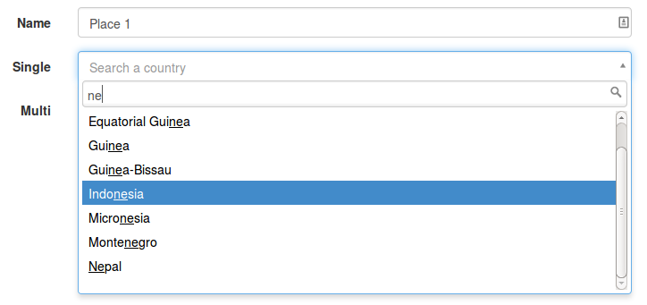
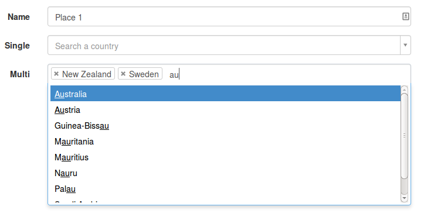

select2entity-bundle
====================

##Introduction##

This is a Symfony2 bundle which enables the popular [Select2](https://select2.github.io) component to be used as a drop-in replacement for a standard entity field on a Symfony form.

The main feature that this bundle provides compared with the standard Symfony entity field (rendered with a html select) is that the list is retrieved via a remote ajax call. This means that the list can be of almost unlimited size. The only limitation is the performance of the database query or whatever that retrieves the data in the remote web service.

It works with both single and multiple selections. If the form is editing a Symfony entity then these modes correspond with many to one and many to many relationships. In multiple mode, most people find the Select2 user interface easier to use than a standard select tag with multiple=true with involves awkward use of the ctrl key etc.

The project was inspired by [lifo/typeahead-bundle](https://github.com/lifo101/typeahead-bundle) which uses the Typeahead component in Bootstrap 2 to provide similar functionality. Select2Entity can be used anywhere Select2 can be installed, including Bootstrap 3.

Thanks to @ismailbaskin we now have Select2 version 4 compatibility.

##Screenshots##

This is a form with a single selection field list expanded.



This is a form with a multiple selection field list expanded.



##Installation##

Select2 must be installed and working first. I hope to setup a demo site but my setup is basically [BraincraftedBootstrapBundle](http://bootstrap.braincrafted.com) with Select2 installed for Bootstrap 3. Once the Braincrafted bundle is working, the only files I've needed to install are:

select2.js, select2.css from https://github.com/select2/select2/tree/4.0.0

select2-bootstrap.css from https://github.com/t0m/select2-bootstrap-css/tree/bootstrap3. That gets it working for Bootstrap 3.

These files live in the Resources/public/js and Resources/public/css folders of one of my bundles and then included in my main layout.html.twig file.

Alternatively, minified versions of select2.js and select2.css can be loaded from the CloudFlare CDN using the two lines of code given here: [https://select2.github.io](https://select2.github.io). Make sure the script tag comes after where jQuery is loaded. That might be in the page footer.

* Add `tetranz/select2entity-bundle` to your projects `composer.json` "requires" section:

```javascript
{
    // ...
    "require": {
        // ...
        "tetranz/select2entity-bundle": "2.*"
    }
}
```
Note that this only works with Select2 version 4. If you are using Select2 version 3.X please use `"tetranz/select2entity-bundle": "1.*"` in `composer.json`

* Run `php composer.phar update tetranz/select2entity-bundle` in your project root.
* Update your project `app/AppKernel.php` file and add this bundle to the $bundles array:

```php
$bundles = array(
    // ...
    new Tetranz\Select2EntityBundle\TetranzSelect2EntityBundle(),
);
```

* Update your project `app/config.yml` file to provide global twig form templates:

```yaml
twig:
    form_themes:
        - 'TetranzSelect2EntityBundle:Form:fields.html.twig'
        
```
* Load the Javascript on the page. The simplest way is to add the following to your layout file. Don't forget to run console assets:install. Alternatively, do something more sophisticated with Assetic.
```
<script src="{{ asset('bundles/tetranzselect2entity/js/select2entity.js') }}"></script>
```

##How to use##

The following is for Symfony 3. The latest version works on both Symfony 2 and Symfony 2 but see https://github.com/tetranz/select2entity-bundle/tree/v2.1 for Symfony 2 configuration and use.

Select2Entity is simple to use. In the buildForm method of a form type class, specify `Select2EntityType::class` as the type where you would otherwise use `entity:class`.

Here's an example:

```php
$builder
   ->add('country', Select2EntityType::class, [
            'multiple' => true,
            'remote_route' => 'tetranz_test_default_countryquery',
            'class' => '\Tetranz\TestBundle\Entity\Country',
            'primary_key' => 'id',
            'text_property' => 'name',
            'minimum_input_length' => 2,
            'page_limit' => 10,
            'allow_clear' => true,
            'delay' => 250,
            'cache' => true,
            'cache_timeout' => 60000, // if 'cache' is true
            'language' => 'en',
            'placeholder' => 'Select a country',
        ])
```
Put this at the top of the file with the form type class:
```php
use Tetranz\Select2EntityBundle\Form\Type\Select2EntityType;
```

##Options##
Defaults will be used for some if not set.
* `class` is your entity class. Required
* `primary_key` is the name of the property used to uniquely identify entities. Defaults to 'id'
* `text_property` This is the entity property used to retrieve the text for existing data. 
If text_property is omitted then the entity is cast to a string. This requires it to have a __toString() method.
* `multiple` True for multiple select (many to many). False for single (many to one) select.
* `minimum_input_length` is the number of keys you need to hit before the search will happen. Defaults to 2.
* `page_limit` This is passed as a query parameter to the remote call. It is intended to be used to limit size of the list returned. Defaults to 10.
* `allow_clear` True will cause Select2 to display a small x for clearing the value. Defaults to false.
* `delay` The delay in milliseconds after a keystroke before trigging another AJAX request. Defaults to 250 ms.
* `placeholder` Placeholder text.
* `language` i18n language code. Defaults to en.
* `cache` Enable AJAX cache. Results will be cached for each 'term' queried.
* `cache_timeout` How long to cache a query in milliseconds. Setting to `0` will cause the cache to never timeout _(60000 = 60 seconds)_
* `transformer` The fully qualified class name of a custom transformer if you need that flexibility as described below.

The url of the remote query can be given by either of two ways: `remote_route` is the Symfony route. 
`remote_params` can be optionally specified to provide parameters. Alternatively, `remote_path` can be used to specify 
the url directly.

The defaults can be changed in your app/config.yml file with the following format.

```yaml
tetranz_select2_entity:
    minimum_input_length: 2
    page_limit: 8
    allow_clear: true
    delay: 500
    language: fr
    cache: false
    cache_timeout: 0
```

##AJAX Response##
The controller should return a `JSON` array in the following format. The properties must be `id` and `text`.

```javascript
[
  { id: 1, text: 'Displayed Text 1' },
  { id: 2, text: 'Displayed Text 2' }
]
```
##Ininite Scrolling##
If your results are being paged via the Select2 "infinite scrolling" feature then you can either continue to return
the same array as shown above _(for Backwards Compatibility this bundle will automatically try to determine if more 
results are needed)_, or you can return an object shown below to have finer control over the paged results.

The `more` field should be true if there are more results to be loaded. 

```javascript
{
  results: [
     { id: 1, text: 'Displayed Text 1' },
     { id: 2, text: 'Displayed Text 2' }
  ],
  more: true
}
```

Your controller action that fetches the results will receive a parameter `page` indicating what page of results should
be loaded. _Note: Select2 does not send `page` on the first request._ 

##Custom option text##
If you need more flexibility in what you display as the text for each option, such as displaying the values of several fields from your entity or showing an image inside, you may define your own custom transformer.
Your transformer must implement DataTransformerInterface. The easiest way is probably to extend EntityToPropertyTransformer or EntitiesToPropertyTransformer and redefine the transform() method. This way you can return as `text` anything you want, not just one entity property.

Here's an example that returns the country name and continent (two different properties in the Country entity):
```php
$builder
    ->add('country', Select2EntityType::class, [
        'multiple' => true,
        'remote_route' => 'tetranz_test_default_countryquery',
        'class' => '\Tetranz\TestBundle\Entity\Country',
        'transformer' => '\Tetranz\TestBundle\Form\DataTransformer\CountryEntitiesToPropertyTransformer',
    ]);
```
In transform sets data array like this:
```php
$data[] = array(
    'id' => $country->getId(),
    'text' => $country->getName().' ('.$country->getContinent()->getName().')',
);
```
Your custom transformer and respectively your Ajax controller should return an array in the following format:
```javascript
[ 
    { id: 1, text: 'United Kingdom (Europe)' },
    { id: 1, text: 'China (Asia)' }
]
```

###Templating###

If you need [Templating](https://select2.github.io/examples.html#templating) in Select2, you could consider the following example that shows the country flag next to each option.

Your custom transformer should return data like this:
```javascript
[ 
    { id: 1, text: 'United Kingdom (Europe)', img: 'images/flags/en.png' },
    { id: 2, text: 'China (Asia)', img: 'images/flags/ch.png' }
]
```
You need to define your own JavaScript function `select2entityAjax` which extends the original one `select2entity` and display custom template with image:
```javascript
$.fn.select2entityAjax = function(action) {
    var action = action || {};
    var template = function (item) {
        var img = item.img || null;
        if (!img) {
            if (item.element && item.element.dataset.img) {
                img = item.element.dataset.img;
            } else {
                return item.text;
            }
        }
        return $(
            '<span> ' + item.text + '</span>'
        );
    };
    this.select2entity($.extend(action, {
        templateResult: template,
        templateSelection: template
    }));
    return this;
};
$('.select2entity').select2entityAjax();
```
This script will add the functionality globally for all elements with class `select2entity`, but if the `img` is not passed it will work as the original `select2entity`.

You also will need to override the following block in your template:
```twig

    <option value="{{ label.id }}" selected="selected"
            
                 data-{{ key }}="{{ data }}"
            >
        {{ label.text }}
    </option>

```
This block adds all additional data needed to the JavaScript function `select2entityAjax`, like data attribute. In this case we are passing `data-img`.

##Embed Collection Forms##
If you use [Embedded Collection Forms](http://symfony.com/doc/current/cookbook/form/form_collections.html) and [data-prototype](http://symfony.com/doc/current/cookbook/form/form_collections.html#allowing-new-tags-with-the-prototype) to add new elements in your form, you will need the following JavaScript that will listen for adding an element `.select2entity`:
```javascript
$('body').on('click', '[data-prototype]', function(e) {
    $(this).prev().find('.select2entity').last().select2entity();
});
```
